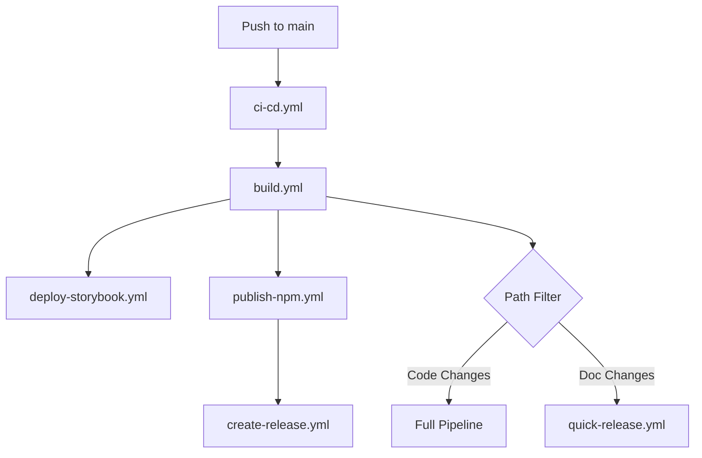
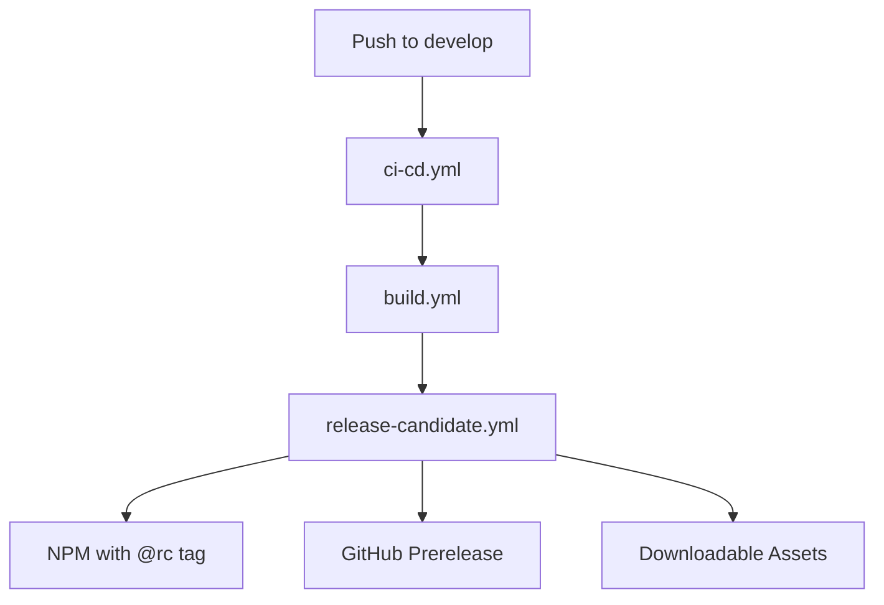

# 🚀 CI/CD Documentation

Este documento describe el sistema completo de CI/CD implementado para MLZ Components, incluyendo workflows automatizados, estrategias de release y configuraciones necesarias.

## 📋 Tabla de Contenidos

- [Arquitectura de Workflows](#arquitectura-de-workflows)
- [Flujos de Trabajo](#flujos-de-trabajo)
- [Configuración Requerida](#configuración-requerida)
- [Estrategia de Releases](#estrategia-de-releases)
- [Monitoreo y Debugging](#monitoreo-y-debugging)

## 🏗️ Arquitectura de Workflows

El sistema de CI/CD está diseñado con una arquitectura modular que separa responsabilidades en workflows específicos:

```
.github/workflows/
├── ci-cd.yml              # 🚦 Orchestrator principal
├── build.yml              # 🔨 Build y testing
├── deploy-storybook.yml   # 📚 Deploy de documentación  
├── publish-npm.yml        # 📦 Publicación a NPM
├── create-release.yml     # 🚀 Creación de releases
├── release-candidate.yml  # 🧪 Release candidates
└── quick-release.yml      # ⚡ Releases rápidos
```

### Beneficios de la Arquitectura Modular:

✅ **Mantenibilidad**: Cada workflow tiene una responsabilidad específica  
✅ **Reutilización**: Los workflows pueden ser llamados desde otros  
✅ **Testing**: Fácil testeo individual de cada componente  
✅ **Escalabilidad**: Agregar nuevos flujos sin afectar existentes  
✅ **Debugging**: Identificación rápida de problemas específicos  

## 🔄 Flujos de Trabajo

### 1. Push a `main` - Production Pipeline



**Trigger**: Push a `main` con cambios en código  
**Duración**: ~5-8 minutos  
**Outputs**: 
- 📦 NPM Package publicado
- 📚 Storybook actualizado en GitHub Pages
- 🚀 GitHub Release creado
- 🏷️ Git tag generado

### 2. Push a `develop` - Release Candidate Pipeline



**Trigger**: Push a `develop`  
**Duración**: ~4-6 minutos  
**Outputs**:
- 🧪 NPM Package con tag `@rc`
- 📋 GitHub Prerelease con assets
- 📊 Build artifacts descargables

### 3. Documentation Only Changes - Quick Release

**Trigger**: Push a `main` solo con cambios en documentación  
**Duración**: ~2-3 minutos  
**Outputs**: Release solo si la versión cambió

## ⚙️ Configuración Requerida

### GitHub Secrets

```bash
# Requerido para publicación NPM
NPM_TOKEN=npm_xxxxxxxxxxxxxxxxxxxxxxxxxxxxxxxxxx
```

### GitHub Settings

1. **Pages**: Habilitar GitHub Pages
   - Source: GitHub Actions
   - Custom domain (opcional)

2. **Permissions**: Actions
   - Read repository contents: ✅
   - Write repository contents: ✅ (para tags)
   - Write packages: ✅ (para releases)

### NPM Configuration

1. **Token Creation**:
   ```bash
   npm login
   npm token create --type=automation
   ```

2. **Organization Setup**:
   - Asegurar permisos en `@sector.siit`
   - Configurar 2FA si es requerido

## 🎯 Estrategia de Releases

### Semantic Versioning

```
version: MAJOR.MINOR.PATCH
example: 1.2.3
```

- **MAJOR**: Breaking changes
- **MINOR**: New features (backward compatible)
- **PATCH**: Bug fixes

### Release Types

#### 🚀 Stable Release (main)
```bash
Version: 1.2.3
NPM Tag: latest
Git Tag: v1.2.3
Trigger: Version change in package.json + push to main
```

#### 🧪 Release Candidate (develop)
```bash
Version: 1.2.3-rc.202508071430
NPM Tag: rc
Git Tag: v1.2.3-rc.202508071430
Trigger: Any push to develop
```

#### ⚡ Quick Release (documentation)
```bash
Condition: Only doc changes + version change
Process: Simplified pipeline
Duration: ~2 minutes
```

### Version Management Workflow

1. **Feature Development**:
   ```bash
   git checkout develop
   git checkout -b feature/new-component
   # Develop feature
   git push origin feature/new-component
   # Create PR to develop
   ```

2. **Release Candidate**:
   ```bash
   git checkout develop
   git merge feature/new-component
   git push origin develop  # Triggers RC
   ```

3. **Production Release**:
   ```bash
   # Update version in package.json
   npm version minor  # or major/patch
   git checkout main
   git merge develop
   git push origin main  # Triggers production release
   ```

## 📊 Monitoreo y Debugging

### GitHub Actions Dashboard

Acceder en: `https://github.com/sector-siit/mlz-components/actions`

### Common Issues & Solutions

#### ❌ "rollup: command not found"
```yaml
# Asegurar que está el paso de instalación
- name: Install dependencies
  run: bun install --frozen-lockfile
```

#### ❌ "NPM_TOKEN not found"
```yaml
# Verificar que el secret está configurado
secrets:
  NPM_TOKEN: ${{ secrets.NPM_TOKEN }}
```

#### ❌ "Version not changed"
```bash
# El workflow skipea si no hay cambio de versión
# Verificar package.json vs NPM
npm view @sector.siit/mlz-components version
```

### Debugging Commands

```bash
# Local testing
bun run build
bun run typecheck
bun run lint
bun run build-storybook

# Version checking
npm view @sector.siit/mlz-components version
npm view @sector.siit/mlz-components versions --json

# Release candidate testing
npm install @sector.siit/mlz-components@rc
```

### Workflow Status Indicators

- ✅ **Success**: Todo funcionó correctamente
- ⚠️ **Warning**: Completado con advertencias
- ❌ **Failed**: Error que requiere atención
- ⏩ **Skipped**: Paso omitido condicionalmente

## 🔧 Maintenance

### Weekly Tasks
- [ ] Revisar logs de workflows
- [ ] Verificar que las dependencias estén actualizadas
- [ ] Comprobar el tamaño del bundle

### Monthly Tasks
- [ ] Actualizar versiones de Actions usadas
- [ ] Revisar métricas de performance
- [ ] Limpiar releases antiguas si es necesario

### Security
- [ ] Rotar NPM tokens cada 6 meses
- [ ] Revisar permisos de workflows
- [ ] Auditar dependencias con `npm audit`

## 📈 Métricas

### Performance Targets
- Build time: < 5 minutos
- Deploy time: < 3 minutos
- Bundle size: < 100KB gzipped

### Success Metrics
- Deploy success rate: > 95%
- Time to production: < 10 minutos
- Zero-downtime deployments: 100%

---

**Nota**: Esta documentación se actualiza automáticamente con cada cambio significativo en los workflows.
